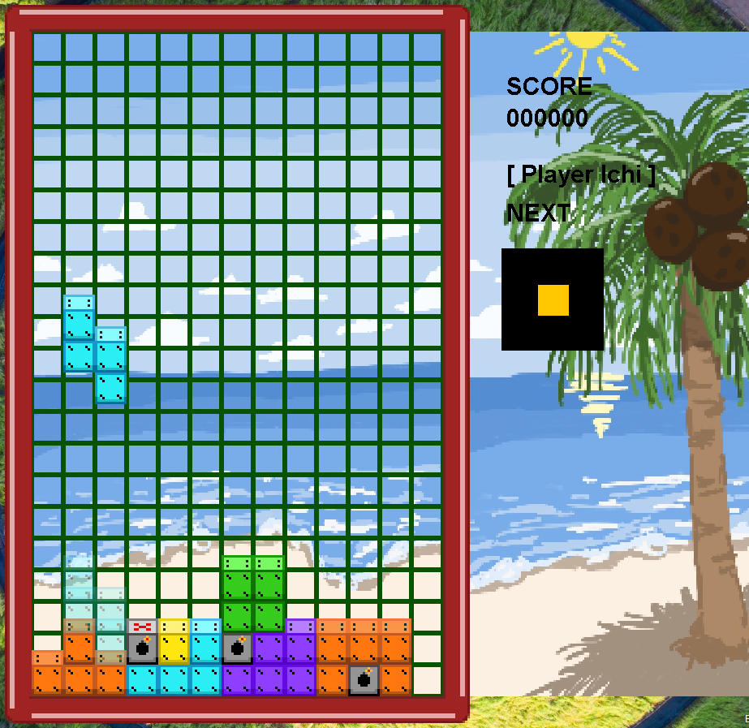
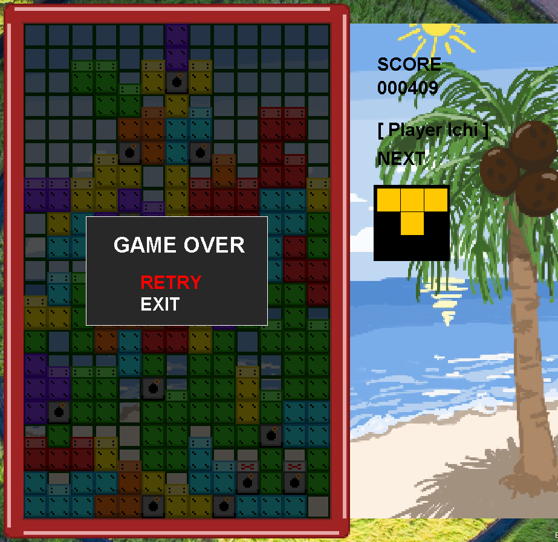

# This is for a school project, nothing else.

## Team members:
- [CrimsonDisk](https://github.com/CrimsonDisk)
- [hohoanghung102007-cloud](https://github.com/hohoanghung102007-cloud)
- [dangkh04](https://github.com/dangkh04)
- [Khuenguyen301107](https://github.com/Khuenguyen301107)

---

# A Tetris Project

## What is this?
It's a Tetris game, but with a new mechanic to be less generic.

**Gameplay:** Classic Tetris-ish, fill a full row to gain score and keep the game running.

**Mechanic:** Bombs, they destroy all blocks on their column and adjacent columns, can trigger chain reaction with other bombs that are on the same full row.

---

### Controls:
- **Arrow keys** for movements (Up and down is also used in the game over menu)
- **Q/E** for left/right rotation
- **Esc** for exit game
- **Enter**, used to select an option

### Stuff used:
- [**Sonic Mania**](https://www.youtube.com/watch?v=BUhuOwwD4n8) sound effects
- [**Bad Apple!! (PJSK)**](https://www.youtube.com/watch?v=v-fc1zv31zE) the song
- [**A meme**](https://x.com/cooldisks101/status/1497054170922115073?s=20)
- Texture assets are **original**

