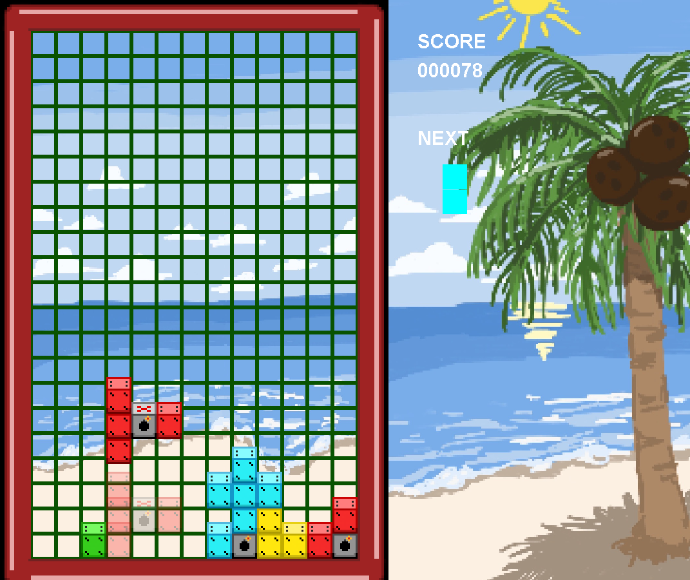

This is for a school project, nothing else.

What is this?
It's a Tetris game, but with a new mechanic to be less generic.
Gameplay: Classic Tetris-ish, fill a full row to gain score and keep the game running.
Mechanic: Bombs, they destroy all blocks on their column and adjacent columns, can trigger chain reaction with other bombs on the same full column.
Controls:
- Arrow keys for movements (Up and down is also used in the game over menu)
- Q/E for left/right rotation
- Esc for exit game
- Enter, used to select an option